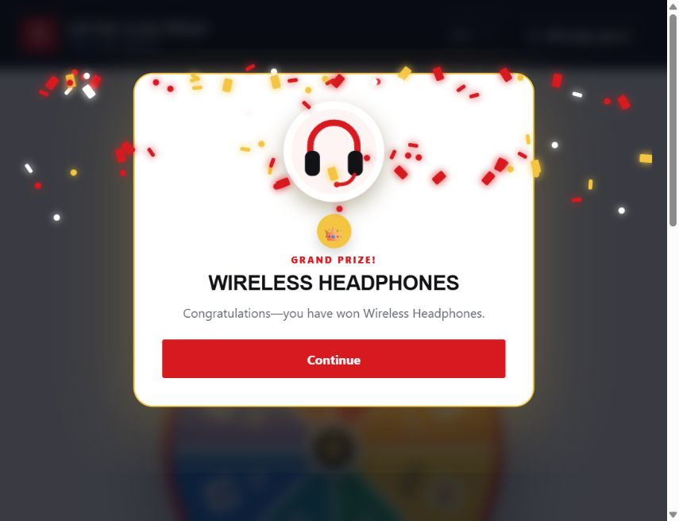
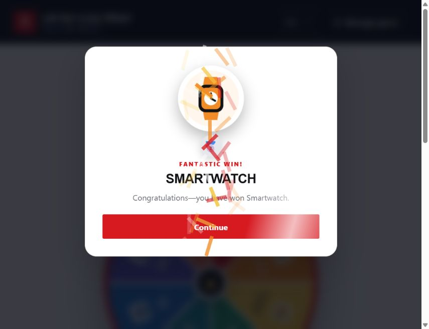
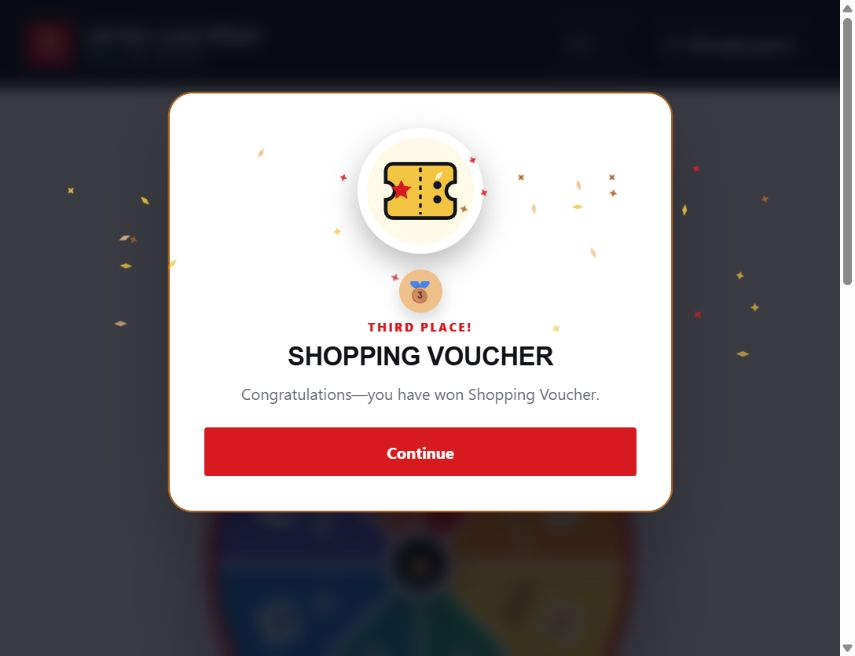
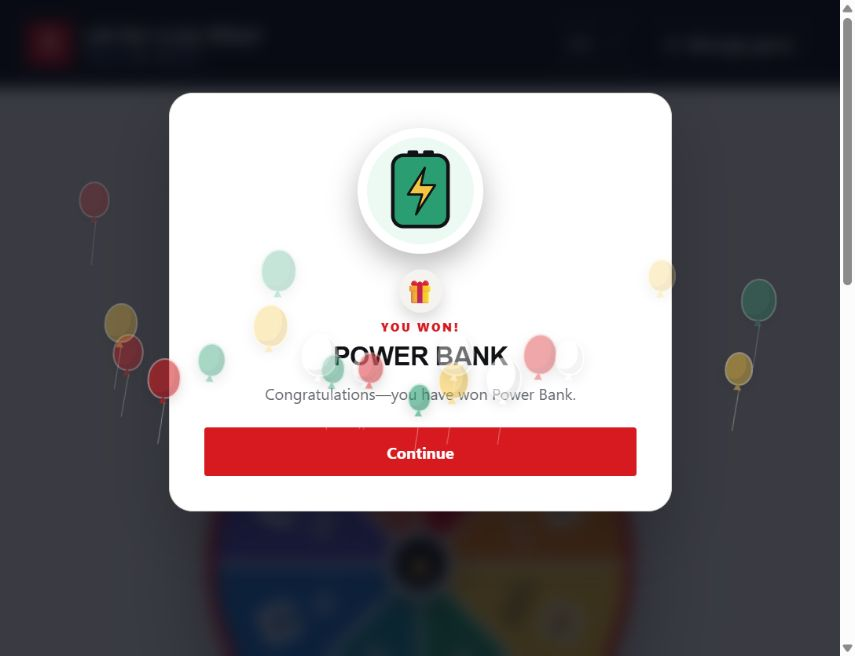

# Job Fair Spinning Wheel Game

A responsive, bilingual spinning-wheel game built with semantic HTML, modular CSS, and vanilla JavaScript. It supports JSON-configured prizes, weighted winner selection, animated prize effects, and persistent inventory management.

## Live demo

[View the production website](https://the-star-practical-test2.vercel.app/)

## Features

- Equal-sized wheel slices for every unique prize
- Weighted prize selection based on configured probabilities
- Automatic stock reduction after a win
- Out-of-stock prizes excluded from future results
- Distinct animations for grand, second, third-place, and consolation prizes
- English and Bahasa Malaysia switching with i18next
- JSON configuration and custom prize-image loading
- Eight bundled sample prizes with individual graphics
- Browser persistence using IndexedDB
- Inventory reset and current JSON export
- Wheel-slice colours controlled by the prize configuration
- Keyboard-friendly controls and reduced-motion support
- Responsive desktop, tablet and mobile layouts

## Prize effects and winner popups

Each prize tier has a distinct celebration effect and a winner popup showing the prize image, name and confirmation message. The screenshots below capture individual animation frames; open the [live demo](https://the-star-practical-test2.vercel.app/) to see the full motion.

| Grand prize                                                                                    | Second prize                                                                             |
| ---------------------------------------------------------------------------------------------- | ---------------------------------------------------------------------------------------- |
|  |  |
| Confetti and a starburst, with a glowing popup and pulsing prize image.                        | Side streamers, a shimmer across the popup and a bouncing prize image.                   |

| Third place                                                                                      | Consolation prize                                                                                 |
| ------------------------------------------------------------------------------------------------ | ------------------------------------------------------------------------------------------------- |
|  |  |
| Bronze sparks, a bronze popup border and a settling prize image.                                 | Rising balloons and a gift badge, with a popping prize image.                                     |

## Requirements

- Node.js 20.19 or newer, or Node.js 22.12 or newer
- npm
- A current version of Chrome, Edge, Firefox or Safari

## Local setup

Open a terminal in the project folder and install the dependencies:

```powershell
npm install
```

Start the development server:

```powershell
npm run dev
```

Open the local address displayed by Vite in the terminal.

## Useful commands

```text
npm run dev          Start the development server
npm run build        Create the production build in dist
npm run preview      Preview the production build after running npm run build
npm run format       Format supported files with Prettier
npm run format:check Check formatting without changing files
```

## Configuration file

The bundled configuration is located at `public/config/prizes.json` and includes eight sample prizes. The following valid two-prize example shows the required structure for a custom game:

```json
{
  "prizes": [
    {
      "id": "grand-prize",
      "name": {
        "en": "Wireless Headphones",
        "ms": "Fon Kepala Tanpa Wayar"
      },
      "quantity": 1,
      "probability": 10,
      "tier": "grand",
      "graphic": "headphones.webp",
      "color": "#d71920"
    },
    {
      "id": "gift-pack",
      "name": {
        "en": "Job Fair Gift Pack",
        "ms": "Pek Hadiah Pameran Kerjaya"
      },
      "quantity": 20,
      "probability": 90,
      "tier": "consolation",
      "graphic": "gift-pack.webp",
      "color": "#2878c8"
    }
  ]
}
```

### Prize fields

| Field         | Description                                                            |
| ------------- | ---------------------------------------------------------------------- |
| `id`          | Unique stable identifier                                               |
| `name.en`     | English prize name                                                     |
| `name.ms`     | Bahasa Malaysia prize name                                             |
| `quantity`    | Available stock as a whole number of zero or greater                   |
| `probability` | Relative chance of winning; initial prize probabilities must total 100 |
| `tier`        | `grand`, `second`, `third` or `consolation`                            |
| `graphic`     | Exact prize-image filename                                             |
| `color`       | Six-digit hexadecimal wheel-slice colour                               |

The wheel always displays equal-sized slices. Probability affects winner selection, not slice size. When a prize reaches zero, it remains visible as out of stock but is excluded from subsequent selections. The remaining probabilities are then normalized automatically.

Only the `prizes` array is needed in JSON. The website title is defined in `src/translations/en.js` and `src/translations/ms.js`, the default language is defined by `DEFAULT_LANGUAGE` in `src/i18n.js`, and the website colours are CSS variables in `src/styles/tokens.css`. English is used until a visitor selects another language; their saved choice is retained when loading a different prize configuration.

Existing configurations that include `version` or `game` are still accepted when their prize data is valid. Those extra fields are ignored and omitted from exports. Previously saved quantities and uploaded images remain usable.

## Loading a custom game

Open **Manage game → Load game**. The upload instructions appear above the file selectors. Use **View JSON format** to open the JSON guide, prepare one JSON configuration, then return to **Load game** and select all images referenced by its `graphic` fields. Select **Load custom game** to apply the configuration.

The configuration file must:

- Be valid JSON and no larger than 1 MB
- Include at least two prizes
- Use a unique ID for every prize
- Use positive probabilities that total 100

Custom images must:

- Be PNG, JPEG or WebP
- Use unique filenames
- Match the JSON filenames exactly
- Be no larger than 2 MB each

Recommended package structure:

```text
game-package/
├── game-config.json
└── images/
    ├── headphones.webp
    └── gift-pack.webp
```

The browser requires the JSON and image files to be selected separately. Local computer paths such as `C:\Users\Name\Pictures\prize.webp` must not be stored in JSON.

## Prize storage

The active configuration, uploaded image files and remaining quantities are stored in IndexedDB. This allows the game to survive refreshes and browser restarts on the same website origin.

Use **Export current JSON** to download the current quantities as `job-fair-prizes.json`, containing only the prize configuration. The browser cannot silently overwrite the originally selected JSON file. Use **Reset inventory** to restore the quantities that were present when the current configuration was first loaded.

Inventory is stored separately for each browser, device and website origin. It is not synchronized across devices, private browsing sessions, Vercel preview URLs or different domains.

## Source structure

```text
docs/screenshots/     Prize-effect and winner-popup screenshots
public/config/        Bundled prize configuration
public/images/prizes/ Bundled sample prize graphics
src/config/           Configuration loading and validation
src/game/             Winner selection and wheel rendering
src/storage/          IndexedDB persistence
src/styles/           Modular stylesheets
src/translations/     English and Bahasa Malaysia interface text
src/effects.js        Tier-specific prize animations
src/i18n.js           Language initialization and translation handling
src/main.js           Application orchestration and interface events
```

## Data and security notes

- Imported JSON is validated before use.
- User-provided names are rendered as text rather than HTML.
- Custom file type and size restrictions are enforced.
- Random selection uses `crypto.getRandomValues()`.
- No selected files or game data are uploaded to a server.
